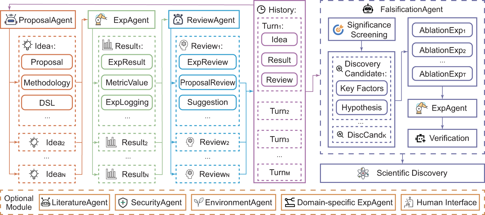

## Abstract

Rapid development of artificial intelligence has drastically accelerated the development of scientific discovery. Trained with large-scale observation data, deep neural networks extract the underlying patterns in an end-to-end manner and assist human researchers with highly-precised predictions in unseen scenarios. The recent rise of Large Language Models (LLMs) and the empowered autonomous agents enable scientists to gain help through interaction in different stages of their research, including but not limited to literature review, research ideation, idea implementation, and academic writing. However, AI researchers instantiated by foundation model empowered agents with full-process autonomy are still in their infancy. In this paper, we study <b>*AI-Generated Science*</b> (AIGS), where agents independently and autonomously complete the entire research process and discover scientific laws. By revisiting the definition of scientific research ([Popper, 1935](https://www.taylorfrancis.com/books/mono/10.4324/9780203994627/logic-scientific-discovery-karl-popper-karl-popper)), we argue that <b>*falsification*</b> is the essence of both human research process and the design of an AIGS system. Through the lens of *falsification*, prior systems attempting towards AI-Generated Science either lack the part in their design, or rely heavily on existing verification engines that narrow the use in specialized domains. In this work, we propose Baby-AIGS as a baby-step demonstration of a full-process AIGS system, which is a multi-agent system with agents in roles representing key research process. By introducing FalsificationAgent, which hypothesize and then verify possible scientific discoveries, we empower the system with explicit <b>*falsification*</b>. We also incorporate techniques to boost overall <b>*executability*</b> of experiment plans and <b>*creativity*</b> during ideation. Experiments on three tasks preliminarily show that Baby-AIGS could produce meaningful scientific discoveries, though not on par with experienced human researchers. 

## Principles of A Full-process AIGS System

When constructing an AIGS system with full-process autonomy, the desiderata of the system design should refer to the definition of the scientific research process itself. As stated by ([Popper, 1935](https://www.taylorfrancis.com/books/mono/10.4324/9780203994627/logic-scientific-discovery-karl-popper-karl-popper)), scientific research follows a systematic process of proposing novel hypotheses, conducting experiments through trial and error, and falsifying these hypotheses to conclude. While it is widely-believed that <b>*creativity*</b> is indispensable in the process of research - which is also accounted in previous work - the central component of scientific research is <b>*falsification*</b>: designing and executing experiments to validate or refute hypotheses, and falsified hypotheses pose positive contributions to scientific progress as well ([ml-retrospectives](https://ml-retrospectives.github.io/)). Moreover, experienced researchers accumulate practical skills or reusable workflows ([Gil et al., 2007](https://ieeexplore.ieee.org/document/4404805)) from hands-on experimentation, which eases the design and execution of experiments and hypothesis falsification. The abstraction of workflows in experiments enables effective reuse, which reflects a high level of <b>*executability*</b> in scientific research. To recapitulate, a creative idea is the beginning of a piece of scientific research, which is followed by experiments and analyses to be conducted; executability forms the basis for falsification, and a sequence of logically consistent falsification processes turns a novel idea into scientific discoveries with genuine creativity. As a result, <b>*falsification*</b> is the foundation of AI-Generated Science, pillared by experimenting scaffolds accounting for <b>*executability*</b> and targeting at the ultimate goal of research <b>*creativity*</b>. 

## Four Paradigms of AI-accelerated Scientific Discovery

    

In this work, we review and envision the development of AI-accelerated scientific discovery as four paradigms: 

(I) <b>AI as a Performance Optimizer</b>, where deep neural networks are trained with large-scale observation data in a specific scientific problem to extract the patterns in an end-to-end manner. In this paradigm, the AI techniques are used to optimize the specific prediction / regression performance in the pre-defined scientific problem with the consideration of out-of-domain generalization. 

(II) <b>AI as a Research Assistant</b>, where LLM-driven research copilots are used to assist the human research process. 

(III) <b>AI as an Automated Scientist</b>. In this regime, foundation model empowered agents with scientist-like behavior should complete the entire research process, ranging from the initial idea proposal to the ultimate delivery of the scientific findings. 

(IV) <b>AI Forms a Research Community</b>. Upon the prosperity of fully-autonomous AI researchers depicted in the previous stage, we envision the collaborations among the agentic researchers foster an AI-formed research community. 

## Baby-AIGS: A Baby Step Towards Full-Process AIGS

    

In our Baby-AIGS system, we recognize that scientific research typically involves the following major phases: *literature review*, *idea formation*, *methodology design*, *experiment execution*, *result analysis*, and *ablation study*. These phases form an iterative circle, with scientific discoveries often emerging through repeated iterations of this process. Aiming at building our system more human-like to benefit from these insights, we model the construction of the agents on these phases. Specifically, LiteratureAgent is responsible for literature review, ProposalAgent is responsible for idea formation and methodology design, ExperimentAgent conducts experiment execution, ReviewAgent handles result analysis and FalsificationAgent carries out ablation studies. In the following, we introduce two most important designs in our system.

    

 
(i) **DSL**: As shown in the picture, we introduce an important but not yet proposed design of the AIGS system: <b>Domain Specific Language (DSL)</b>. DSL acts a critical role in constructing a fully autonomous AIGS pipeline. Specifically, DSL is a pre-designed, structured object output directly by ProposalAgent, which can help interpret the generated idea and methodology into system executable code. For instance, in a deep learning task, DSL can directly be the code to train the model, and in a chemistry experiment, DSL can be the action to manipulate a microscope. In this manner, DSL bridges the gap between proposal formulation and experimental execution, effectively addressing the issue of improperly executed proposals.

(ii) <b>FalsificationAgent</b> in the Baby-AIGS system conducts an explicit process of falsification by verifying experimental discoveries through systematic ablation studies. It analyzes experimental records, including proposals, results, and reviews, to identify factors contributing to significant improvements. By examining entire chains of iterations, it derives scientific discovery candidates and proposes targeted ablation studies to isolate and validate specific causes behind improvements. Using repeated experiments on both baseline and ablation setups, FalsificationAgent confirms whether a discovery consistently holds true, ensuring only robust scientific principles are validated.

## Experiment Setup and Results

### Data Engineering

The task here is to identify key distinguishing features of high-quality datasets, which allows Baby-AIGS to filter and extract high-quality data subsets. Through this approach, Baby-AIGS seeks to enhance data quality and relevance, making downstream tasks more effective.

### Self-Instruct Alignment

This task involves constructing an optimal set of seed instructions and using these to iteratively generate an instruction-response dataset for enhanced model self-instruction. By refining the alignment between instructions and responses, Baby-AIGS aims to improve the model's capacity for autonomous learning and adaptation.

### Language Modeling

In this task, Baby-AIGS experiments with various structural adjustments to language models with the aim of improving pre-training outcomes. Through architecture exploration, the system seeks to enhance both model efficiency and the quality of generated text, as reflected in metrics like perplexity.

## Discussions

<b>Q1: Why is falsification important in automated research systems?</b>

Falsification is essential in automated research systems as it provides a rigorous mechanism for hypothesis testing, a core component in the scientific method. In Baby-AIGS, FalsificationAgent plays a crucial role in formulating hypotheses, systematically isolating experimental variables, and conducting ablations to validate scientific insights. This approach ensures that the system not only generates hypotheses but also actively challenges and refines them, producing reliable knowledge with minimized biases. Without falsification, the system could misinterpret or overfit patterns within datasets, leading to less generalizable scientific findings.

<b>Q2: How does the Baby-AIGS system boost creativity?</b>

Baby-AIGS enhances creativity by integrating a multi-sampling approach combined with re-ranking, allowing it to generate diverse research proposals and rank them based on validation benchmarks. This process, facilitated by ProposalAgent, enables the generation of unique and innovative ideas, pushing the boundaries of traditional benchmarks. In tasks like *Self-Instruct Alignment*, Baby-AIGS shows substantial creativity, generating novel instruction datasets that improve alignment quality. This iterative proposal refinement and re-ranking process adds a layer of quality assurance, driving high creative output in various scientific domains.

<b>Q3: Why could DSL help with conductibility?</b>

The use of a Domain-Specific Language (DSL) in Baby-AIGS facilitates conductibility by providing a structured and executable representation of ideas and methodologies proposed by ProposalAgent. DSL enhances the system’s ability to translate complex scientific workflows into actionable experiment plans. In our experiments, DSL significantly improved success rates in generating scientifically valuable outcomes, underscoring its role in achieving high executability. This abstraction of executable workflows allows Baby-AIGS to transition seamlessly from ideation to experimentation, reducing ambiguity and ensuring consistent, reproducible research outcomes.

## Actionable Insights

Envisioning the future of AI-generated science systems powered by foundation models in real-world, in this section, we provide insights on the next steps of research from AIGS.

<b>Balance idea diversity and experimental conductibility.</b>

The design of the DSL enhances the conductibility of ideas but may constrain creativity. Therefore, achieving a balance between idea diversity and experimental conductibility requires further empirical analysis, with one potential avenue being enabling agents to develop their own DSLs.

<b>Establish systematic mechanisms for evaluation and feedback.</b>

The quality of AIGS system depends heavily on rigorous evaluation of prior proposals, methods, and results. Future work should explore systematic mechanisms to analyze outcomes across iterations, maximizing experience transfer and continuous improvement.

<b>Strengthen the falsification procedure.</b>

Our research underscores the importance of falsification to enhance the scientific rigor of the research findings. While we have prototyped the falsification process in our multi-agent AIGS system, more efforts are required to strengthen the modules related to knowledge falsification.

<b>Expand channels for scientific knowledge dissemination.</b>

While ([Lu et al., 2024](https://arxiv.org/abs/2408.06292)) focus on disseminating knowledge through research papers, alternative formats like posters, podcasts, and videos are gaining traction with the rise of multi-modal agents. Future research should also explore more efficient communication channels between AI systems, beyond structured text or natural language.

<b>Investigate the communication dynamics among the agentic researchers.</b>

The long-term vision for AIGS systems involves the formation of an AI research community. Therefore, deeper exploration of these interactions, particularly within a multi-agent environment, will be crucial for fostering effective collaborations.

<b>Promote interdisciplinary knowledge integration.</b>

Further developments would extend research systems to address challenges in other scientific fields, such as biology, chemistry, and physics. The major challenge lies in how AI agents can synthesize and align domain-specific knowledge from multiple fields. Furthermore, encouraging collaboration between AI systems working across disciplines may generate more innovative hypotheses and solutions.

